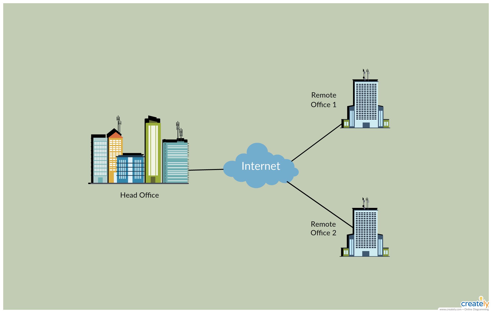

# Distributed Systems Lab 2 : Database Synchronization with RabbitMQ


## The Problem
<blockquote>
Obviously, there are tons of different ways to synchronize distributed databases. Let's imagine that we have an unusual situation with restrictions below:

- A future system will have some Head Office (HO) and a couple of Branch Offices (BOs).
- All offices are located in different places, and some of them have limitation with the internet connection. It could even be a situation where the internet is available for 1-2 hours per day.
</blockquote>



<blockquote>
    The perfect solution is to write your own DB sync
    mechanism data between branches using **RabbitMQ**
    Message queues.
    
For this lab we assume one Head Office (HO) and 2 Branch offices (BO) for sales. The 2 sales branches are physically separated from the Head office. They manage their databases independently and they need to synchronise their data to the Head office that maintain the hole data of sales. We assume that the database are based on the product sales table with the following structure.
</blockquote>

<div style="text-align:center">
  
</div>

<blockquote>
The main of this lab is to create a distributed application that synchronisation databases from the product sales tables. This application needs to use the RabbitMQ to send data on the related queues. We run 2 distributed processes that synchronise data from first BO to HO and the second BO to the HO. 
</blockquote>


For this lab we use **Python** with **SQLAlchemy ORM** for **MySQL** databases for sales. So, 3 databases are needed for the 2 BO and one HO. The synchronisation is made by the 2
BOs. 

## The Solution
Each operation on one of the two branch databases is saved in a migration script file that is sent to the RabbitMQ server each time the user synchronizes to the Head office.
- If the Head Office database monitoring application is subscribed to the RabbitMQ server, it will receive the migration script file and execute it on the Head Office database.
- When the head office receives the migration script file through the synchronization service, it sends an acknowledgment to publisher of that message. The branch receives the acknowledgment and deletes the content the migration script file from the RabbitMQ server.
- After consuming the message from the RabbitMQ queue, the synchronization service writes the command on a migration file and executes it on the Head Office database.

The Head Office database monitoring application uses the features offered by the Synchronization service to monitor the Head Office database.
## How to use
### Requirements
- Python 3.x
- RabbitMQ
- MySQL
    #### Python packages
    - SQLAlchemy
    - Pika
    - PyMySQL
    - tkinter
    - mysql-connector-python

    run command to install all packages
    ```bash
    pip install -r requirements.txt
    ```
### Run
1. Run **RabbitMQ** server
2. Run **MySQL** server
3. Run Branch Office 1
```shell
cd "Branch Office 1"
python main.py
```
4. Run Branch Office 2
```shell
cd "Branch Office 2"
python main.py
```
5. Run Head Office database monitoring application
```shell
cd "Head Office"
python main.py
```
6. Run Head Office synchronization service
```shell
cd "Head Office"
python synchronization.py
```
7. perform some operations on Branch Office 1 and Branch Office 2
8. Sync data from Branch Office 1 or Branch Office 2 to Head Office. To do that, click on the **Sync** button on Branch Office GUI.
9.  Check the synchronization result on Head Office database monitoring application
## References
- [RabbitMQ](https://www.rabbitmq.com/)
- [SQLAlchemy](https://www.sqlalchemy.org/)
- [Pika](https://pika.readthedocs.io/en/stable/)
- [tkinter](https://docs.python.org/3/library/tkinter.html)
- [MySQL](https://www.mysql.com/)
- [Python](https://www.python.org/)
- [PyMySQL](https://pymysql.readthedocs.io/en/latest/)
- [mysql-connector-python](https://dev.mysql.com/doc/connector-python/en/)

## License
[MIT](https://choosealicense.com/licenses/mit/)

## Author
- [Mohamed Ali Selmi](https://github.com/mrdaliselmi)
